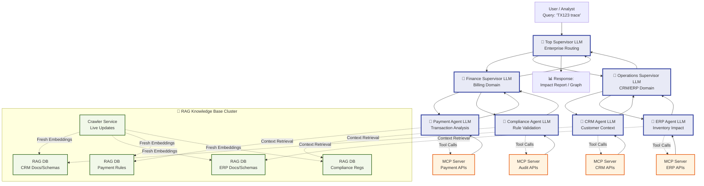

TX123 Query → TopLLM: "Route to Finance+Operations domains"
  ↓
FinLLM: "Delegate to Payment+Compliance for billing trace"
  ↓
PaymentLLM → RAG DB3: "What rules modify transaction amounts?"
PaymentLLM → MCP Server1: "Fetch TX123 payment record"
PaymentLLM reasoning: "Amount +10% → geo-tax rule match → HIGH impact"
  ↑
FinLLM aggregates: "Billing impact: +10% due to tax, compliance PASS"
  ↑
TopLLM final synthesis: "TX123 total impact across 4 systems"


LLM Reasoning Flow: TX123 Order Placement Trace

```text
QUERY: "Trace TX123 order placement - show modifications in each system"

↓

**🧠 Top Supervisor LLM** [Enterprise Router]
Input: "TX123 order placement trace"
Reasoning: "Order placement affects CRM→ERP→Payment→Compliance"
Routing Decision: 

{
"task": "order_trace",
"txn_id": "TX123",
"domains": ["Operations", "Finance"],
"priority": "high"
}

text
→ Delegates to OpsLLM + FinLLM concurrently

↓

**🧠 Operations Supervisor LLM** [CRM/ERP Domain]
Input: `{"txn_id": "TX123", "scope": "order_flow"}`
Reasoning: "Order placement starts in CRM, inventory check in ERP"
→ Delegates: CRM Agent (customer data) + ERP Agent (inventory)

  ↓↓ (parallel)
  
**🧠 CRM Agent LLM**
RAG Query: "TX123 customer record changes?"
Tool Call → MCP Server3: `GET /crm/tx/123/history`
Result: `"shipping_address": "Chennai→Mumbai", "customer_tier": "Silver→Gold"`

**Analysis**: "Address change may trigger shipping recalc, tier upgrade affects discounts"

**🧠 ERP Agent LLM**  
RAG Query: "TX123 inventory/business rules?"
Tool Call → MCP Server4: `GET /erp/order/123/status`
Result: `"quantity": "2→1", "status": "pending→partial_ship"`

**Analysis**: "Quantity reduced 50%, partial shipment triggered"

↓

**Operations Summary** → OpsLLM:

{
"CRM": {"address_change": "Chennai→Mumbai", "impact": "shipping recalc"},
"ERP": {"quantity_reduced": "2→1", "impact": "partial fulfillment"}
}

text

↓

**🧠 Finance Supervisor LLM** [Billing Domain]
Input: Ops summary + `"TX123 billing trace"`
Reasoning: "Address+quantity changes affect pricing"

  ↓↓ (parallel)
  
**🧠 Payment Agent LLM**
RAG Query: "TX123 payment modifications?"
Tool Call → MCP Server1: `GET /payment/tx/123/audit`
Result: `"amount": "₹10,000→₹8,500", "reason": "tier_discount"`

**Analysis**: "15% discount applied due to Gold tier upgrade"

**🧠 Compliance Agent LLM**
RAG Query: "Mumbai address compliance rules?"
Tool Call → MCP Server2: `GET /audit/tx/123`
Result: `"gst_rate": "18%→12%", "valid": true`

**Analysis**: "State change valid, GST recalculated correctly"

↓

**Finance Summary** → FinLLM:

{
"Payment": {"discount_applied": "₹1500", "impact": "total_recalc"},
"Compliance": {"gst_adjusted": "18→12%", "status": "PASS"}
}

text

↓

**🧠 Top Supervisor LLM** [Final Synthesis]
Inputs: Ops summary + Finance summary
**Final Reasoning**:

TX123 MODIFICATION CHAIN:

    CRM: Address Chg → triggered shipping recalc

    ERP: Qty 2→1 → partial fulfillment

    Compliance: GST 18→12% → interstate rules

    Payment: ₹10k→₹8.5k → tier discount applied

PRIMARY IMPACT: Total order value -15%, fulfillment delayed
ROOT CAUSE: Customer address change + tier upgrade

text

↓

**📊 Final Report**:

TX123 ORDER TRACE IMPACT ANALYSIS
┌─────────────────────────────────────┐
│ CRM: Address Chg │ ❌ HIGH
│ ERP: Qty 2→1 │ ⚠️ MEDIUM
│ Compliance: GST 18→12% │ ✅ LOW
│ Payment: ₹10k→₹8.5k │ ❌ HIGH
│─────────────────────────────────────┤
│ TOTAL IMPACT: Order value -15% │
└─────────────────────────────────────┘
```
text

## Key Insights Demonstrated

1. **Hierarchical Reasoning**: Each LLM specializes (routing→domain→analysis)
2. **Cross-System Correlation**: Address change cascades through all systems  
3. **RAG+Tools Integration**: Context (rules) + live data → intelligent analysis
4. **Impact Scoring**: Quantifies business consequences automatically

Perfect for showing your team how the system traces **real enterprise complexity** beyond simple data lookup!

      
